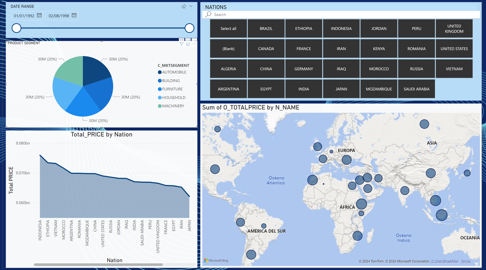
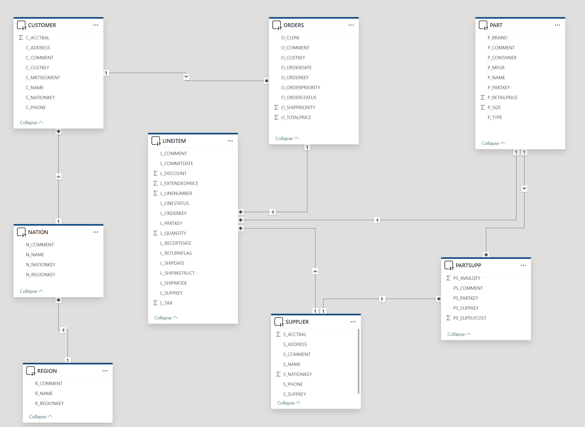

# REPORT

---
---

## SNOWFLAKE

DabaBase: ***TPCH_S1000***

---
---

## TABLES
-	Customer
- 	Orders
- 	Lineitem
- 	Part
- 	Partsupp
- 	Supplier
- 	Nation
- 	Region

---
---

## RELATION SCHEMA
-	Customer.c_custkey 1->* Orders.o_custkey
-	Orders.o_orderkey 1->* Lineitem.l_orderkey
-	Part.p_partkey 1->+ Lineitem.l_partkey
-	Supplier.s_suppkey 1->* Lineitem.l_suppkey
-	Part.p_partkey 1->* Partsupp.ps_partkey
-	Supplier.s_suppkey 1->* Partsupp.ps_suppkey
-	Nation.n_nationkey 1->* Customer.c_nationkey
-	Region.r_regionkey 1->* Nation.n_regionkey
-	Supplier.s_nationkey -> Nation.n_nationkey  (❗Conflict)

---
---

## POWER BI

### ERRORS
- 	Charts that do not load because they have too many records (more than 100,000)

